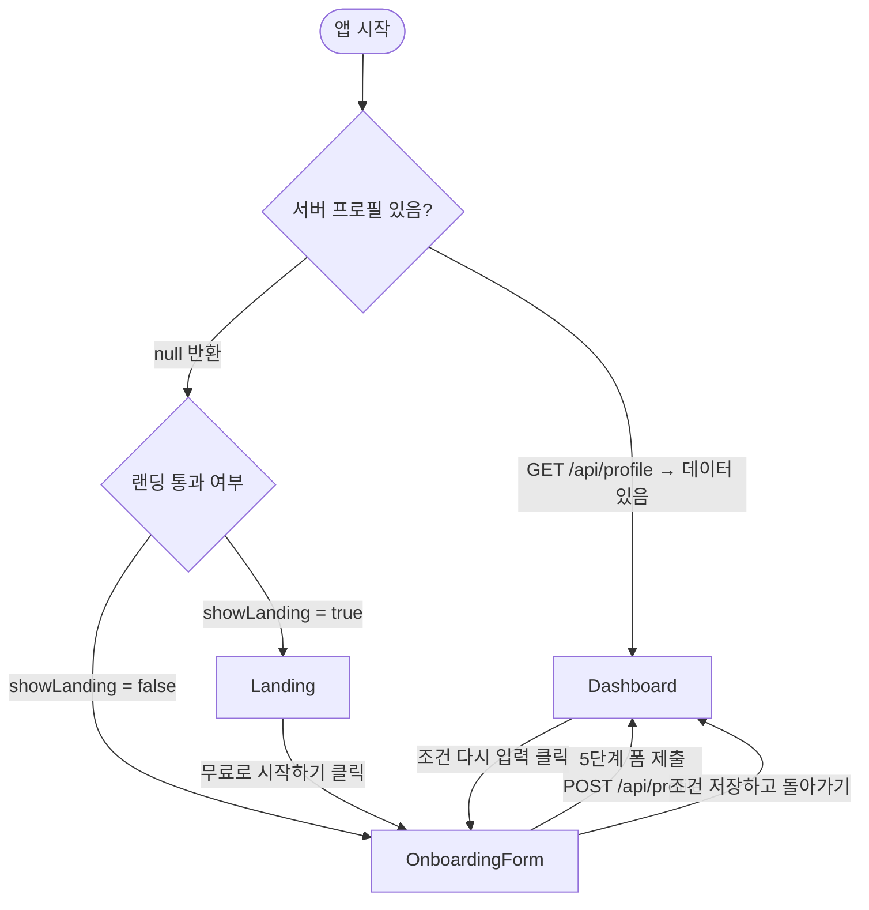
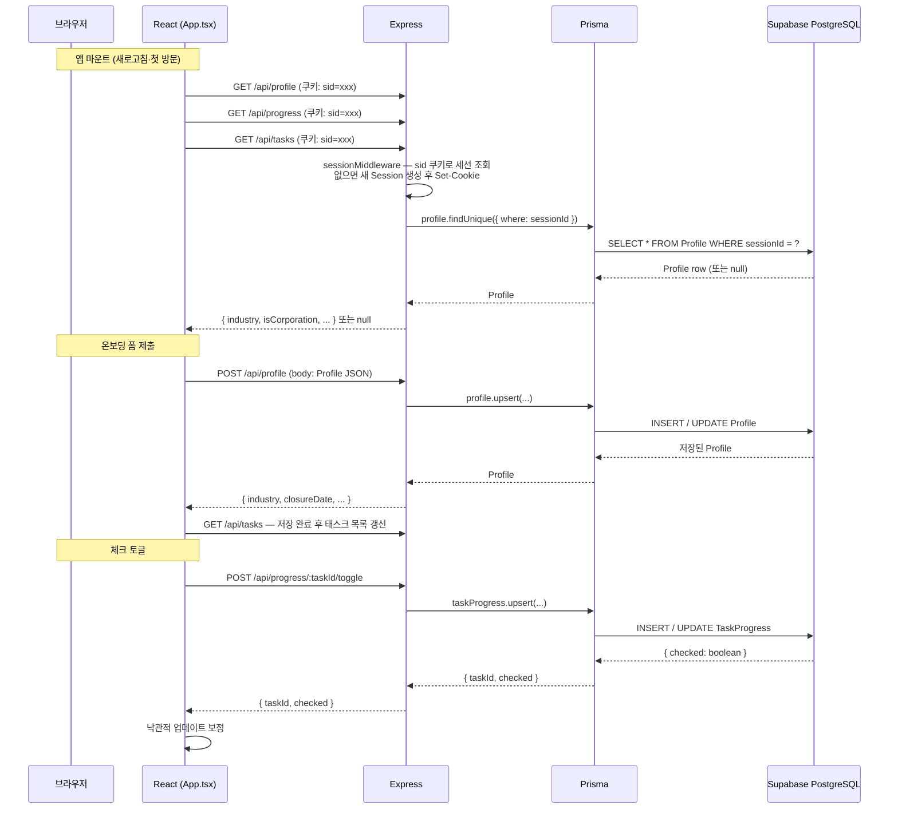
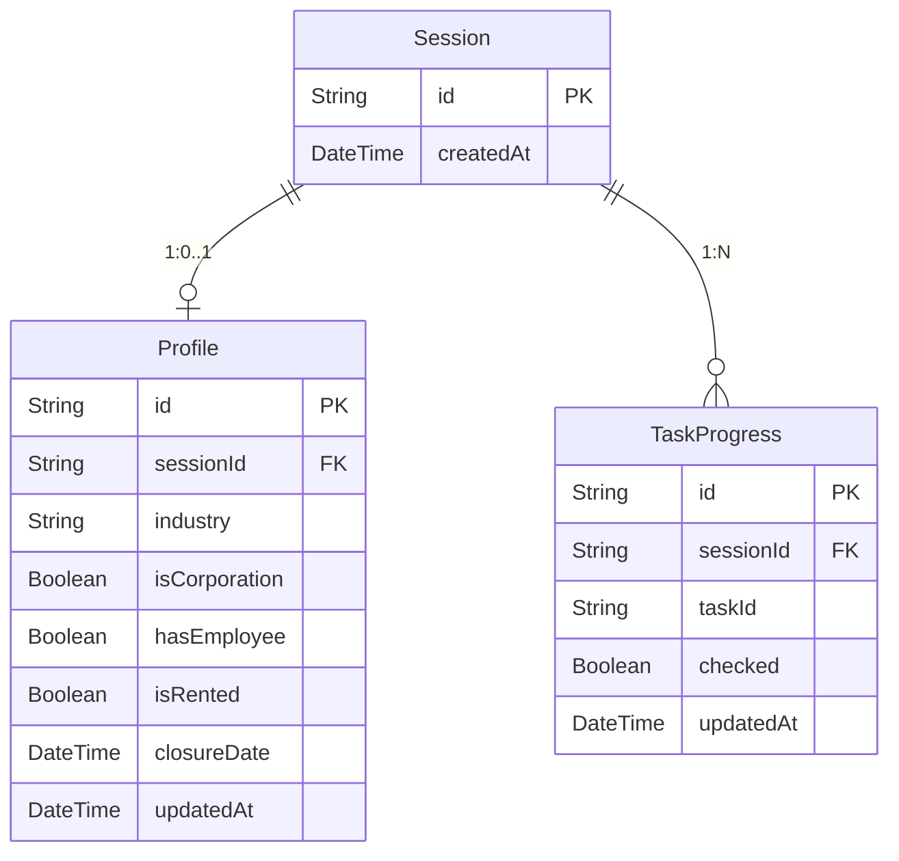

# 아키텍처 다이어그램

## 1. 화면 전환 흐름도

**설계 의도:** 라우터(React Router 등) 없이 `App.tsx`의 상태 3개(`profile`, `showLanding`, `isEditingProfile`)만으로 화면 전환을 관리합니다. URL이 바뀌지 않아 북마크·뒤로가기는 지원하지 않지만, 단일 페이지 체크리스트 도구라는 성격상 그 복잡성이 불필요하다고 판단했습니다.

---

## 2. API 데이터 흐름도

**설계 의도:**
- **익명 세션:** 회원가입 없이 쿠키(`sid`) 하나로 사용자를 식별합니다. 세션은 최초 요청 시 서버가 자동 발급합니다.
- **병렬 fetch:** 마운트 시 profile·progress·tasks를 `Promise.allSettled`로 동시에 요청해 초기 로딩 시간을 줄입니다.
- **낙관적 업데이트:** 체크 토글 시 서버 응답 전에 UI를 먼저 바꾸고, 서버 응답으로 보정합니다. 실패 시 롤백합니다.

---

## 3. DB 스키마 관계도

**설계 의도:**
- **Session ↔ Profile (1:0..1):** 세션 하나에 프로필이 최대 하나입니다. 온보딩을 완료하지 않은 세션은 Profile 없이 존재합니다.
- **Session ↔ TaskProgress (1:N):** 하나의 세션이 여러 task의 체크 상태를 가집니다. `[sessionId, taskId]` 복합 유니크 제약으로 같은 task를 중복 저장하지 않습니다.
- **taskId는 외래 키 없음:** task 목록(`src/data/tasks.ts`)이 코드에 정의되어 있고 DB 테이블이 아니므로, DB 레벨 참조 무결성 대신 애플리케이션 레벨에서 관리합니다.
