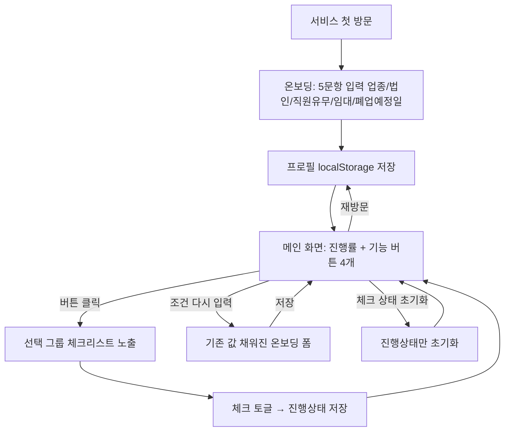

# 기획서 — 소상공인 폐업 도우미 서비스

> v1(초기 기획)과 v2(React 프로토타입 구현 후 갱신)를 합쳐 실제 구현 상태와 일치시킨 최종본입니다.

## 1. 문제 정의

소상공인이 폐업할 때 챙겨야 할 정보(폐업신고 절차, 세무 신고, 정부 지원금)는 홈택스, 정부24, bizinfo.go.kr, 소상공인시장진흥공단 등 **여러 공식 사이트에 흩어져 있다**.

사용자는 다음 세 가지 어려움을 동시에 겪는다.
1. **정보가 흩어져 있음**: 절차마다 담당 기관·사이트가 다름
2. **내 상황에 뭐가 해당하는지 모름**: 업종·직원 유무·임대 여부에 따라 필요한 절차가 달라지는데, 이를 구분해주는 곳이 없음
3. **마감을 놓치기 쉬움**: 세무 신고처럼 기한이 있는 항목의 우선순위를 알려주는 곳이 없음

**이 서비스가 푸는 문제**: 소상공인이 자신의 상황을 한 번 입력하면, 그에 맞는 폐업 절차·세무 일정·지원금 항목만 추려서 보여주고, 마감이 임박한 순서대로 무엇을 먼저 해야 하는지 안내하며, 지금까지 얼마나 처리했는지 한 곳에서 확인할 수 있게 한다.

## 2. 유사 서비스 분석

| 서비스 | 운영 주체 | 핵심 기능 | 방식 |
|---|---|---|---|
| **희망리턴패키지** | 소상공인시장진흥공단 | 사업정리컨설팅, 점포철거비 지원(최대 600만원), 법률자문, 채무조정, 재취업 교육 | 신청 → 심사 → 전문가 배정 → 지원 (신청형) |
| **폐업119** | 한국폐업지원희망정책협회 | 폐업 진단, 변호사/컨설턴트 매칭, 중고 집기 역경매 마켓플레이스, 구인·구직 연계 | 진단 → 전문가/거래 매칭 (**유료 중개형**) |
| **정부24 "소상공인 재기지원"** | 행정안전부 | 민원 신청 창구 안내 | 정보 제공형 |
| **찾기쉬운 생활법령정보 (easylaw.go.kr)** | 법제처 | 폐업 관련 법령을 일반인이 읽기 쉽게 정리 | 정적 정보 제공형 |

**공통 패턴**: 위 서비스들은 모두 "신청 → 전문가 배정/매칭 → 처리를 기다림"의 흐름이거나, 법령·절차를 있는 그대로 나열하는 정보 제공형이다. **개인 상황에 맞춰 항목을 걸러주고, 스스로 진행 상태를 추적하게 해주는 셀프서비스형 도구는 존재하지 않는다.**

## 3. 이 프로그램의 차별점

1. **무료 셀프가이드 (중개·거래 없음)**: 폐업119처럼 변호사·컨설턴트·중고거래를 연결하는 유료 중개가 아니라, 정보 확인과 진행 추적만 제공. 중개가 없으므로 수수료도, 중개업 관련 법적 책임도 없다.
2. **상황 기반 맞춤 필터링 + 근거 표시**: "직원이 있다고 답하셔서 이 항목이 포함됐어요"처럼 왜 이 항목이 나에게 해당하는지 근거를 보여주는 서비스는 조사한 범위에서 없었다.
3. **D-day 우선순위 정렬**: 폐업 예정일 기준으로 계산한 마감기한을 임박한 순서로 보여줘 "지금 뭐부터 해야 하는지" 알려준다. 기존 서비스는 카테고리별 나열에 그친다.
4. **진행률 대시보드**: "몇 개 중 몇 개 완료"를 한눈에 보여주는 진행 추적 UI는 신청형 서비스에는 없는 개념이다.
5. **조건을 바꿔가며 비교** *(프로토타입 구현 후 추가)*: "조건 다시 입력"으로 직원 유무·업종 등을 하나씩 바꿔보며 체크리스트가 어떻게 달라지는지 손쉽게 비교할 수 있다. 기존 값이 그대로 채워진 채로 열려 처음부터 다시 입력할 필요가 없다.

## 4. 기능 명세 (핵심 기능)

### 4-1. 상황 진단 온보딩 (5문항)
업종 / 개인·법인 여부 / 직원 유무 / 임대 여부 / **폐업 예정일**. 폐업 예정일은 각 항목의 D-day 계산 기준일로 쓰인다. 이미 프로필이 있는 상태에서 재진입하면 기존 값이 채워진 폼이 열린다 (`initialProfile`).

> v1에서는 4문항(업종/개인·법인/직원유무/임대여부)이었으나, D-day 계산을 위해 프로토타입 구현 과정에서 "폐업 예정일"이 5번째 질문으로 추가됐다.

### 4-2. 폐업 신고 절차 안내
국세청·지자체에 제출해야 하는 폐업 신고 관련 할 일을 프로필 조건에 따라 필터링해 제공한다. 각 항목은 제목·근거·공식 출처 링크·마감기한(D-day)을 포함하고 체크로 완료 표시한다.
- "관할 세무서 폐업신고"(전원, 폐업일+20일), "4대보험 상실신고"(직원 있음, 폐업일+14일), "임대차 계약 해지·원상복구 안내"(임대)

### 4-3. 세무 신고 일정 안내 *(구 "세무 정산 가이드" — 세무사법 리스크로 명칭 변경)*
폐업 시 처리할 세무 신고(부가세 확정신고, 종합소득세 신고 등) 일정과 준비 서류를 안내한다. 세율·환급액 등 구체 수치는 표기하지 않고 홈택스 공식 페이지로 링크한다. "대리"가 아닌 "일정 안내"로 포지셔닝한다.
- "부가세 확정신고 일정 안내"(전원, 폐업일이 속한 달의 다음 달 25일), "종합소득세 신고 일정 안내"(전원, 다음 해 5월 31일)

### 4-4. 지원금 및 재기 지원
프로필 조건에 맞는 정부 지원사업(예: 희망리턴패키지 점포철거비)을 필터링해 신청 조건 요약과 공식 신청 페이지 링크를 제공한다.
- "점포철거비 지원(희망리턴패키지)"(임대), "재창업·재취업 교육 정보"(전원)

### 4-5. 메인 화면 + 맞춤 체크리스트
대시보드는 2단 구조다.
1. **상단**: 전체 진행률 바 + 기능별 버튼 4개(전체보기/폐업신고/세무/지원금, 각 버튼에 해당 항목 개수 표시)
2. **하단**: 버튼을 클릭해야 그 아래에 해당 그룹의 체크리스트가 나타난다 (아무것도 선택 안 하면 "위 버튼을 눌러 체크리스트를 확인하세요" 안내만 표시). 각 카드에는 근거·설명·출처 링크·최종 확인일·D-day 배지가 있다.

> v1에서는 온보딩 제출 후 곧장 체크리스트가 뜨는 구조였으나, 프로토타입을 써보면서 기능별 버튼을 먼저 누르는 2단 구조로 변경됐다.

### 4-6. 항목 상세 안내 원칙 (콘텐츠 안전, 4-2~4-4 공통 적용)
각 항목은 제목, 한 줄 설명, 근거, 공식 출처 링크, 최종 확인일을 갖는다. 세율·금액·정확한 기한 같은 구체 수치는 앱이 직접 단정하지 않고 공식 링크로 위임한다 (법적 검토 참고). 화면에 디스클레이머를 고정 노출한다.

### 4-7. 조건 재입력 및 체크 초기화 *(프로토타입 구현 후 추가)*
- **조건 다시 입력**: 대시보드 상단 버튼 → 기존 값이 채워진 온보딩 폼 → 수정 후 저장하면 대시보드로 복귀. 체크 상태는 유지된다 (같은 작업 항목 id 기준이므로).
- **체크 상태 초기화**: 조건은 그대로 두고 체크 표시만 전부 지운다.
- 두 기능을 분리한 이유는, 조건만 바꿔서 비교하고 싶을 때 체크 표시까지 같이 사라지면 "이 항목을 아까 체크했었나?" 하는 혼란이 생기기 때문이다.

### UI 원칙 *(프로토타입 구현 후 추가)*
시스템 다크모드에서 어두운 배경에 어두운 글자색이 겹쳐 가독성이 떨어졌던 문제를 고쳐, `color-scheme: light`로 고정하고 밝은 배경(#fff/#f9fafb)·고대비 텍스트(#111827)·큰 글씨(본문 1.05rem 이상, 카드 제목 1.2rem)로 통일했다.

### 서브 기능 (이번 범위 밖, 이후 고도화)
- 로그인 기반 계정/기기 간 동기화 (지금은 무로그인·`localStorage` 기반으로 대체)
- 지원금 목록의 공공데이터포털 API 실시간 연동 (지금은 정적 데이터)
- 업종별 세분화된 절차 확장

## 5. Use Case

### Use Case 다이어그램

### Use Case 상세 정의

**UC-1. 상황 진단 (신규 진입)**
- Precondition: 저장된 프로필 없음
- Main flow: 온보딩 5문항 입력 → 제출 → 프로필 저장 → 메인 화면 진입

**UC-2. 기능 버튼으로 체크리스트 조회**
- Precondition: 프로필 존재
- Main flow: 메인 화면에서 버튼 클릭 → 해당 그룹(또는 전체) 항목이 D-day 임박 순으로 하단에 표시 (근거·출처·D-day 포함)

**UC-3. 항목 체크**
- Main flow: 카드 체크박스 클릭 → 진행상태 저장 → 상단 진행률 갱신

**UC-4. 재방문**
- Main flow: 저장된 프로필로 즉시 메인 화면 진입 (온보딩 재입력 불필요)

**UC-5. 조건 다시 입력**
- Precondition: 프로필 존재
- Main flow: 메인 화면 "조건 다시 입력" 클릭 → 기존 값 채워진 폼 → 일부 값만 수정(예: 직원 유무) → 저장 → 메인 화면으로 복귀, 바뀐 조건 기준으로 체크리스트 재계산
- Postcondition: 체크 상태는 유지됨

**UC-6. 체크 상태 초기화**
- Main flow: 메인 화면 "체크 상태 초기화" 클릭 → 모든 항목의 체크 표시 제거 → 진행률 0%로 리셋

## 6. 사용자 시나리오

**시나리오 1 — 첫 방문·온보딩**: 요식업을 운영하다 폐업을 결심한 개인사업자 A씨(직원 2명, 임대 매장, 폐업 예정일 8월 5일)가 5문항에 답하면, 자신에게 해당하는 항목만 걸러진 메인 화면이 뜬다.

**시나리오 2 — 메인 화면에서 버튼 클릭**: A씨가 "세무 신고 일정" 버튼을 누르니 그 아래에 "부가세 확정신고 일정 안내(D-51)", "종합소득세 신고 일정 안내"가 나타난다.

**시나리오 3 — 폐업 신고 절차 처리**: "4대보험 상실신고"를 클릭하면 "직원이 있다고 답하셔서 포함됐어요"라는 근거와 공식 링크가 뜨고, 처리 후 체크한다.

**시나리오 4 — 지원금 확인**: "지원금 및 재기 지원" 버튼을 누르면 임대 사업장이라 "점포철거비 지원" 항목이 근거와 함께 뜬다.

**시나리오 5 — 조건 비교**: A씨는 만약 직원이 없었다면 어떤 항목이 빠지는지 궁금해서 "조건 다시 입력"을 누르고 "직원이 있어요" 체크만 해제해본다. 저장하고 돌아오니 "4대보험 상실신고" 항목이 사라진 걸 확인하고, 다시 체크해 원래 상태로 되돌린다.

## 7. 기술 스택

| 영역 | 현재(프로토타입) | 이후 단계(예정) |
|---|---|---|
| 프론트엔드 | React + Vite + TypeScript | 동일 |
| 데이터 저장 | `localStorage` (`useLocalStorage` 훅으로 캡슐화) | Express API 호출로 교체 |
| 백엔드 | 없음 | Express (Node.js/TypeScript) |
| ORM | 없음 | Prisma |
| 데이터베이스 | 없음 | SQLite |
| 사용자 구분 | 브라우저 1개 = 사용자 1명 (기기 간 동기화 없음) | 쿠키 기반 익명 세션 ID (`crypto.randomUUID()`) |
| 화면 전환 | `useState` 기반, 라이브러리 없음 | 동일 |
| 배포 | 미정 | SQLite 특성상 지속 디스크를 제공하는 PaaS(Render/Railway 등) 필요 |

`useLocalStorage` 훅으로 데이터 접근을 분리해뒀기 때문에, 이후 백엔드가 준비되면 이 훅의 내부 구현만 API 호출로 바꾸면 되고 컴포넌트 쪽 코드는 거의 손댈 필요가 없다.

## 8. 법적 검토

**세무사법 리스크 (가장 중요한 발견)**
2026년 개정 세무사법에 따라, 무자격자가 세무대리 업무를 하는 것처럼 표시·광고하는 것 자체가 처벌 대상이다 (세무사법 제20조의3, 최대 징역 1년 또는 벌금 1천만원). "세무 정산", "환급", "신고 대행", "장부작성 대행" 같은 표현이 특히 위험하다.
- **대응**: 기능명을 "세무 정산 가이드" → **"세무 신고 일정 안내"**로 변경. "대행"이 아니라 "안내/정리"라는 뉘앙스로 한정. 화면에 "본 서비스는 세무·법률 대리 업무를 수행하지 않으며, 정확한 내용은 관할 기관에서 확인하세요" 디스클레이머 고정 노출.

**변호사법 관련 유의사항**
임대차 해지, 계약 분쟁 등 법률 관련 안내도 비슷한 논리로 "법률 자문"처럼 보이지 않도록 주의가 필요하다. 절차 안내 수준에 그치고, 구체적 법적 판단(승소 가능성, 특정 조항 해석 등)은 다루지 않는다.

**정보 정확성 책임**
세율, 지원금 정확한 금액, 서류 제출 기한처럼 자주 바뀌고 틀리면 위험한 수치는 앱이 직접 명시하지 않고 공식 출처 링크로 위임한다. 각 항목에 "최종 확인일"을 표시해 정보의 신선도를 사용자가 판단할 수 있게 한다.

**개인정보보호법 검토**
- 진단 입력값(업종/개인·법인/직원유무/임대여부/폐업예정일)은 특정 개인을 식별할 수 없는 수준이라 현재 설계로는 개인정보보호법상 리스크가 낮다.
- 서버 도입 이후에도 **이름·연락처·사업자등록번호 등 PII는 수집하지 않는다**는 원칙을 고정한다. 서버에는 익명 세션 ID + 프로필 값 + 체크 상태만 저장한다.
- 로그인 기능이나 지원금 신청 연계로 실명·연락처를 받게 되는 순간부터는 개인정보 수집 목적 고지·동의 절차가 필요해지므로, 그 시점에 별도로 재검토가 필요하다 (이번 범위 밖).

## 9. 구현 로드맵

1. ~~백엔드 기초 세팅~~ → **React 전용 프로토타입으로 순서 변경, 완료**
   - 타입 정의, `useLocalStorage`, 작업 항목 데이터셋, 온보딩 폼(5문항), 메인화면+체크리스트, 조건 재입력/체크 초기화 — 모두 구현 완료
2. **다음 단계**: `server/` 디렉토리에 Express+TS, Prisma+SQLite 초기화. `Session`/`Profile`/`TaskProgress` 스키마, 쿠키 기반 익명 세션 미들웨어. `useLocalStorage` 대신 API 호출로 교체.
3. 지원금 목록 공공데이터포털 API 연동(선택, 이후 고도화)
4. 다듬기 및 제출: 반응형/접근성 점검, 빌드·린트 통과, `work` 브랜치 커밋 → push → base `maeumum`으로 PR

## 검증 방법
- `npm run build`, `npm run lint` 통과 (완료, 확인됨)
- 브라우저에서 온보딩(5문항) → 메인 화면 버튼 클릭 → 체크리스트 노출 → 체크 → 새로고침 후 유지 → 조건 다시 입력(기존 값 프리필 확인) → 체크 상태 초기화 순으로 수동 확인
- 백엔드 도입 이후에는 로컬 Express 서버 기동 후 `curl`로 `/api/profile`, `/api/tasks`, `/api/tasks/:id/toggle` 호출해 응답 및 SQLite 반영 확인 추가 예정
